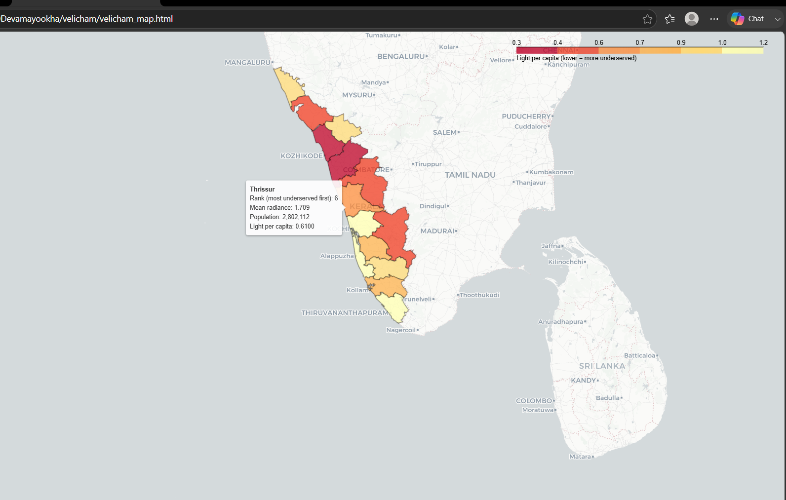

# Velicham — Mapping the Light Gap

*Velicham means "light" in Malayalam.*

Using satellite nighttime-lights imagery to identify Kerala's most underserved districts — areas where light-per-person is lowest, a proxy for under-electrification and under-investment relative to where people actually live.

Built for **Build for Good 2026** — AWAAZ track (Voice, Safety & Social Access).

## Live Demo
[https://devamayookha.github.io/velicham/velicham_map.html](https://devamayookha.github.io/velicham/velicham_map.html)



## What it does

Velicham pulls VIIRS nighttime-lights satellite data and population data for all 14 districts of Kerala via Google Earth Engine, computes a light-intensity-per-capita ratio for each, and ranks them. Districts with low light relative to population are flagged as potential targets for government scheme outreach, electrification investment, and civic infrastructure attention — turning a satellite data product into an actionable, district-level priority list.

## Key finding

Among Kerala's 14 districts, **Malappuram** currently ranks lowest on light-per-capita.

**Honest caveat**: this metric is influenced by population density as well as actual development level — a sparsely populated district can score well simply because there are fewer people to divide by, not necessarily because it's better served. Raw radiance values are included alongside the ratio in the interactive map so the finding can be read in context, not in isolation.

## Methodology

| Component | Source |
|---|---|
| Night-lights | VIIRS DNB monthly composites (NOAA), 2024 median, via Google Earth Engine |
| Population | WorldPop 100m gridded population estimates, India |
| District boundaries | FAO GAUL 2015 Level 2 administrative boundaries |
| Metric | `light_per_capita = mean_radiance / total_population × 1,000,000` |

## Tech stack

Python · Google Earth Engine API · geemap · pandas · folium · GitHub Pages

## How to run locally

```bash
git clone https://github.com/devamayookha/velicham.git
cd velicham
python -m venv venv
venv\Scripts\activate          # Windows
pip install earthengine-api geemap pandas folium

python velicham_statewide_analysis.py   # pulls data, computes rankings
python velicham_map.py                  # renders the interactive map
```

Requires a free Google Earth Engine account (non-commercial tier) — see [earthengine.google.com/signup](https://earthengine.google.com/signup).

## Future work

- Drill down from district-level to taluk/panchayat granularity
- Cross-reference rankings with actual government scheme enrollment data
- Add a built-up-area-normalized metric as a density-controlled alternative to per-capita

## Author

Built solo by B R Devamayookha for Build for Good 2026.
